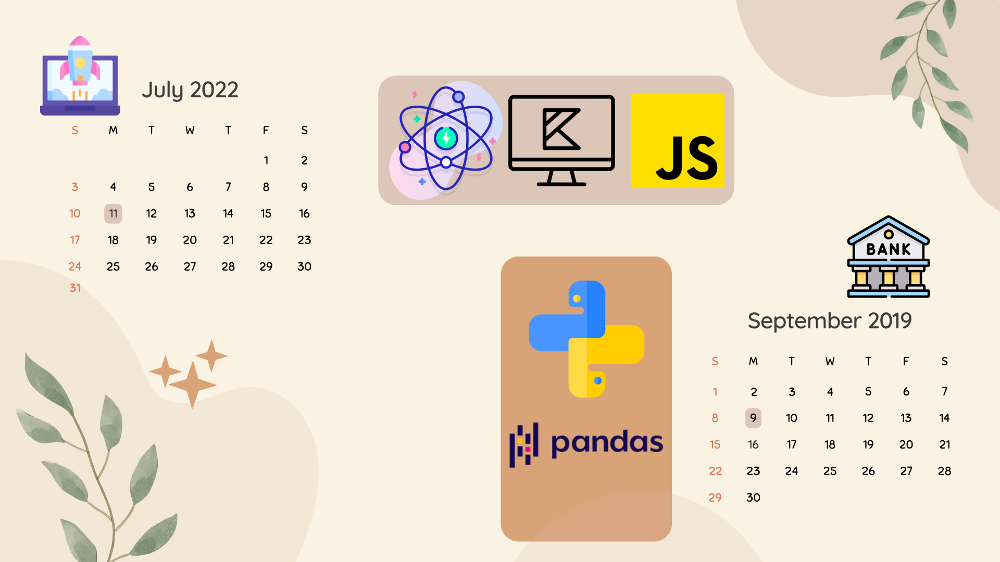

Currently a software engineer developing product at **Upstart**.

- Tech stack: `React`, `Kotlin`, `Typescript`,`NextJS`,`SpringBoot`

Previously an innovative **Data Scientist** with experience in analytics and success in credit risk management, digitization and customer relationship management.

- Tech stack: `Python`, `pandas`, `xlwings`, `Excel`, `PowerBI`, `SQLite`

Personally I'm a huge fan of Rilakkuma, especially Korilakkuma.

##### Attributions

- <a href="https://www.flaticon.com/free-icons/atom" title="atom icons">Atom icons created by Freepik - Flaticon</a>
- <a href="https://www.flaticon.com/free-icons/javascript" title="javascript icons">Javascript icons created by Freepik - Flaticon</a>
- <a href="https://www.flaticon.com/free-icons/python" title="python icons">Python icons created by Freepik - Flaticon</a>
- <a href="https://commons.wikimedia.org/wiki/File:Pandas_logo.svg">Marc Garcia</a>, <a href="http://opensource.org/licenses/bsd-license.php">BSD</a>, via Wikimedia Commons
- <a href="https://www.flaticon.com/free-icons/seo-and-web" title="seo and web icons">Seo and web icons created by Freepik - Flaticon</a>
- <a href="https://www.flaticon.com/free-icons/bank" title="bank icons">Bank icons created by Freepik - Flaticon</a>
