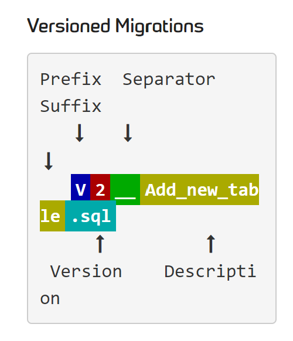

**[R2DBC](https://r2dbc.io/)** provides a fully-reactive non-blocking API to work with relational database. Most of the tutorials involving R2DBC and Spring data are written in Java, and sometimes it might be hard to find examples on Kotlin. That's why I wrote this tutorial, hoping to provide some persepctives on how to handle data with `Kotlin` & `ReactiveCrudRepository`.

## Set Up & Configurations

We will skip configurations here for simplicity purpose. In this example, we are using `Flyway` as our database migration tool. Since flyway uses versioned migrations, and each versioned migration must be assigned a unique version -- we are going to first create a sql named `V1_CREATE_NEW_TABLES.sql` under the `db/migration` folder. (See the following naming convention from Flyway)


Here is an example of the migration file:


CREATE TABLE IF NOT EXISTS employee (
    id BIGSERIAL PRIMARY KEY,
    name varchar(20),
    email varchar(50),
    date_of_birth timestamp
);


## Table configuration

In order to access the tables from the database, we need to setup the tables within a data class. Let's create an entity class with the help of table annotation.
Note that in some tutorials the `Column` annotation is used, but since in our example the column name is actually the same, we did not need to use that.

@Table("employee")
class EmployeeEntity(
    @Id val id:Long,
    val name: String,
    val dateOfBirth: LocalDateTime
)


## Custom Repository

In order to achieve some CRUD functionality, we will use `ReactiveCrudRepository` interface, which comes with many handy default functions such as `findById`, `findAll`,etc.

Here we will just implement three basic functions: **update**, **save** and **find**.

First we need to create a repository.


interface EmployeeRepository:ReactiveCrudRepository<EmployeeEntity,Long>{}


Then we create a data manager to use some custom functionalities from the `ReactiveCrudRepository`.

```kotlin
class EmployeeManager(val employeeRepository: EmployeeRepository){
  
  fun findByEmployeeId(id:Long, consumer: Consumer<EmployeeEntity>){
    employeeRepository.findById(id).subscribe(consumer)
  }

  // Saves the entity
  fun saveEmployee(entity: EmployeeEntity, consumer: Consumer<EmployeeEntity>){
    employeeRepository.save(entity).subscribe(consumer)
  }

  // First check if the id exists in the entity, then update
  // Let's say we would like to update the employee name
   fun updateEmployee(id:Long, 
                       updateValue: String, 
                       consumer: Consumer<EmployeeEntity>){
        if(!employeeRepository.existsById(id)!!){
            throw NoSuchElementException
        }
        employeeRepository
            .findById(id)
            .flatMap { result -> result.map(result.name = updateValue) }
    }
}
```

## Test

After implementing the functionalities, don't forget to test your code. 
Here are some possible tests for the functionalities we implemented:
- Find
  - returns a value if the id exists
  - returns empty value if the id does not exist
- Save
  - saves the entity
- Update
  - updates the entity if the new id doesn't exist in the entity

## Conclusion

I'm still new in Kotlin, but I hope this tutorial helps! 
